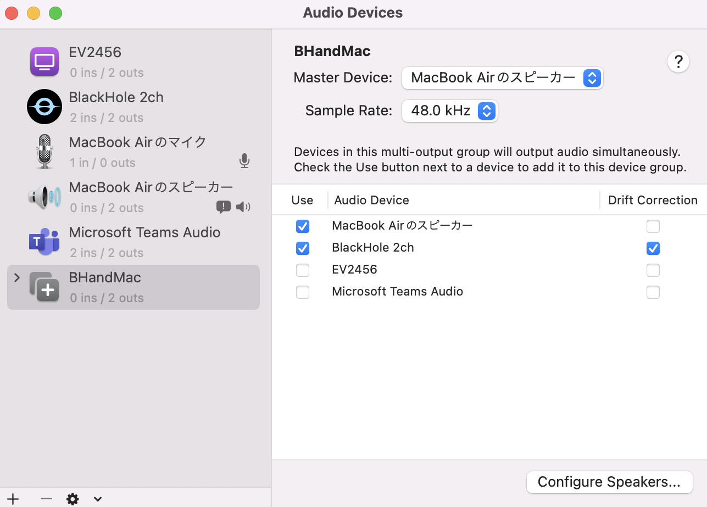

<!-- # Whisper-Secretary
Whisper is your secretary. You can record video meeting as text in your terminal.

Whisper: https://github.com/openai/whisper 

## Preparement

### System preparement -->
<!-- This repository is for Apple Silicon Mac. Use brew to install some packages. Setting below must be done to get speaker's output as mike's input in your Mac.

```brew install ffmpeg```

```brew install blackhole-2ch```

BlackHole: https://github.com/ExistentialAudio/BlackHole 

Then you should set Audio Midi Setting of your Mac.



Push + button (lower left) and add select "Create Multi-Output Device"

Check the check boxes of Mac's speaker and BlackHole 2ch

Then move to Sound setting from System Preference and change sound output into multi output device you made.


### Python preparement
Use Python 3.10.

```brew install portaudio```

```pip install -r requirements.txt``` 

## Run!

```python main.py```

Your terminal becomes your secretary :)

When stopping, please push ```control+C```

 -->


# Whisper-Secretary
Whisper-Secretary is a tool that allows you to record video meetings as text in your terminal. With Whisper-Secretary, you can keep a record of your meetings and easily search for important information without having to sift through lengthy video recordings.

## Getting Started
### System Requirements
Whisper-Secretary is designed for Apple Silicon Mac. To get started, you'll need to use Homebrew to install a few packages:

```
brew install ffmpeg
brew install blackhole-2ch
```

You'll also need to install BlackHole, which is a virtual audio device that allows you to capture the audio output from your Mac.

To set up BlackHole, follow these steps:

1. Open Audio MIDI Setup on your Mac.
2. Click the "+" button in the bottom left corner and select "Create Multi-Output Device".
3. Check the boxes for your Mac's speaker and BlackHole 2ch.

4. Open System Preferences and navigate to Sound.
5. Change the sound output to the multi-output device you created.


### Python Requirements
Whisper-Secretary requires Python 3.10. To install the necessary Python packages, run the following command:

```
brew install portaudio
pip install -r requirements.txt
```

## Usage
To use Whisper-Secretary, run the following command:

```
python main.py
```

This will start recording your meeting and transcribing it to text in your terminal. To stop recording, press ```Ctrl + C```.

## Conclusion
With Whisper-Secretary, you can keep a record of your meetings and easily search for important information without having to sift through lengthy video recordings. We hope you find this tool useful! If you have any questions or feedback, please don't hesitate to reach out.